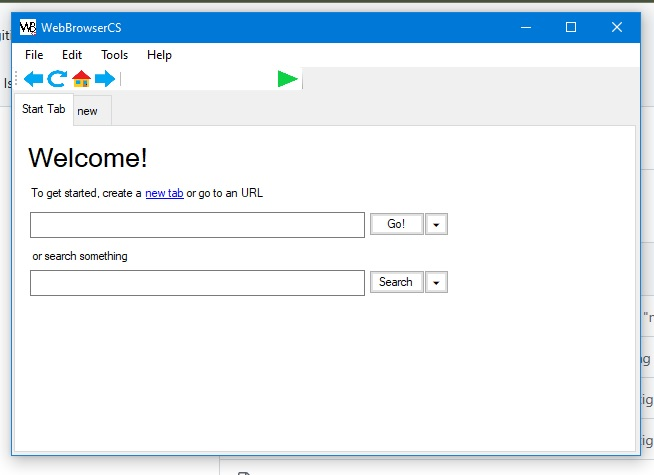
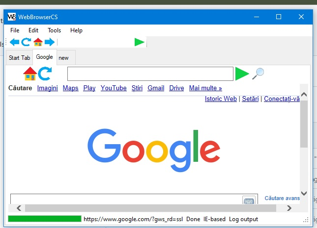
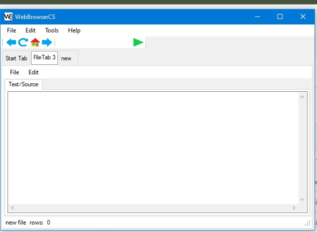
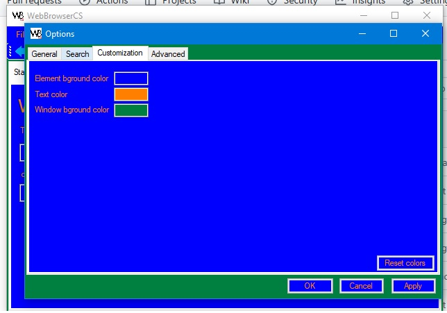

# WebBrowserCS
A web browser

## Features:

- WebBrowser element based IE tab

- CEFSharp Chromium based tab

- Text editor tab

You can also customize the colors however you like, will be applied almost everywhere!

